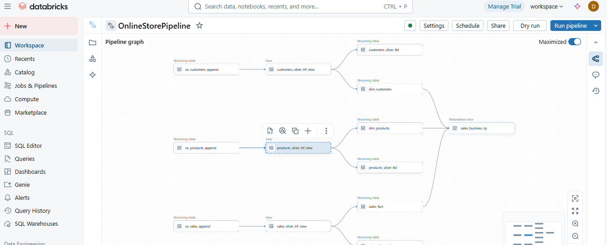
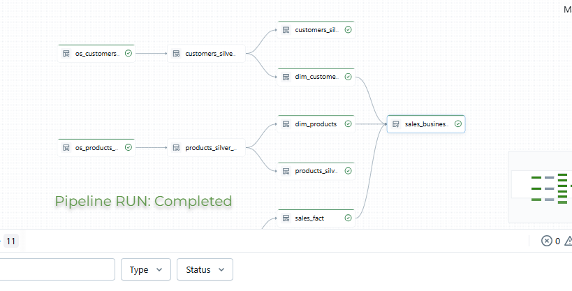
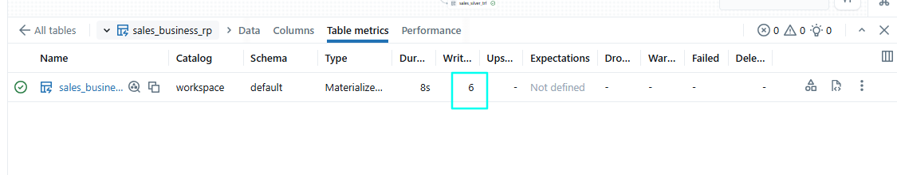

# DLT Online Sales Pipeline (POC)

This project implements a **Delta Live Tables (DLT)** streaming pipeline following the **Medallion Architecture** (Bronze, Silver, Gold layers) for processing sales data. The pipeline is designed to handle streaming data ingestion, transformation, and aggregation to provide reliable, scalable, and maintainable data processing for business analytics.

### Author : SAIDA.D

## Overview
The **DLT Sales Pipeline** processes streaming sales data (e.g., orders, products,customer interactions) using **Delta Live Tables** in Databricks. The pipeline follows the **Medallion Architecture** to ensure data quality, scalability, and ease of maintenance:
- **Bronze Layer**: Raw, unprocessed data ingestion with minimal transformations.
- **Silver Layer**: Cleansed and enriched data with business logic applied.
- **Gold Layer**: Aggregated, business-ready datasets for reporting and analytics.

This pipeline is built for scalability and fault tolerance, leveraging Delta Live Tables' streaming capabilities and Databricks' managed infrastructure.

## Architecture
The pipeline follows the **Medallion Architecture** with three distinct layers:

1. **Bronze Layer**:
   - Ingests raw streaming data (e.g., JSON, CSV, or Parquet) from sources like Kafka, Event Hubs, or cloud storage. (this POC worked on existing DLT tables where created from SQL Warehouse)
   - Stores data in Delta format with minimal processing to preserve the original structure.
   - Handles schema evolution and data quality checks.

2. **Silver Layer**:
   - Applies data cleansing, normalization, and enrichment.
   - Performs deduplication, joins, and filtering to ensure data consistency.
   - Enforces data quality rules (e.g., null checks, data type validation).

3. **Gold Layer**:
   - Aggregates data for business use cases (e.g., sales by region, product performance, or customer metrics).
   - Optimizes data for reporting, dashboards, and downstream analytics.
   - Stores curated datasets in Delta tables for efficient querying.

## Prerequisites
To deploy and run this pipeline, you need:
- **Databricks Workspace** with Delta Live Tables enabled.
- **Databricks Runtime** 10.4 LTS or higher (with Delta Lake support).
- **Cloud Storage** (e.g., ADLS, S3, GCS) for input data and Delta table storage.
- **Streaming Source** (e.g., Kafka, Event Hubs, or cloud storage with streaming files).
- **Databricks CLI** or **REST API** access for pipeline deployment.
- Python 3.8+ and required libraries (e.g., `pyspark`, `delta`).
- Access to a compute cluster with sufficient resources for streaming workloads.

## Setup Instructions
1. **Clone the Repository**:
   ```bash
   git clone https://github.com/your-org/dlt-sales-pipeline.git
   cd dlt-sales-pipeline
   ```

2. **Configure Databricks Workspace**:
   - Set up a Databricks workspace and create a cluster with Delta Live Tables support.
   - Configure cloud storage paths for input data, checkpoints, and output Delta tables.
   - Update the `config.yaml` file with your storage paths, credentials, and pipeline settings.

3. **Install Dependencies**:
   Install required Python libraries:
   ```bash
   pip install -r requirements.txt
   ```

4. **Deploy the Pipeline**:
   - Use the Databricks CLI or REST API to deploy the pipeline:
     ```bash
     databricks pipelines create --settings pipeline.json
     ```
   - Alternatively, import the pipeline configuration via the Databricks UI.

5. **Set Up Input Data**:
   - Ensure your streaming data source (e.g., Kafka topic, cloud storage directory) is accessible.
   - Validate that input data matches the expected schema (defined in `schemas/bronze_schema.json`).

## Running the Pipeline
1. **Start the Pipeline**:
   - Use the Databricks UI to start the pipeline or run:
     ```bash
     databricks pipelines start <pipeline-id>
     ```

2. **Monitor Progress**:
   - Check pipeline status and logs in the Databricks UI.
   - Verify data flow through Bronze, Silver, and Gold tables.

3. **Validate Output**:
   - Query Gold tables using SQL or Spark to ensure data accuracy.
   - Example query:
     ```sql
     SELECT region, SUM(sales_amount) as total_sales
     FROM delta.`dbfs:/mnt/gold/sales`
     GROUP BY region;
     ```







## Monitoring and Maintenance
- **Monitoring**:
  - Use Databricks DLT UI to track pipeline health, latency, and errors.
  - Set up alerts for pipeline failures or data quality issues.
- **Maintenance**:
  - Regularly update schemas in `schemas/` to handle source data changes.
  - Optimize Delta tables using `OPTIMIZE` and `VACUUM` commands.
  - Monitor storage costs and clean up old checkpoints.

## Contributing
Contributions are welcome! Please follow these steps:
1. Fork the repository.
2. Create a feature branch (`git checkout -b feature/your-feature`).
3. Commit your changes (`git commit -m "Add your feature"`).
4. Push to the branch (`git push origin feature/your-feature`).
5. Open a pull request.

## License
This project is licensed under the MIT License. See the [LICENSE](LICENSE) file for details.